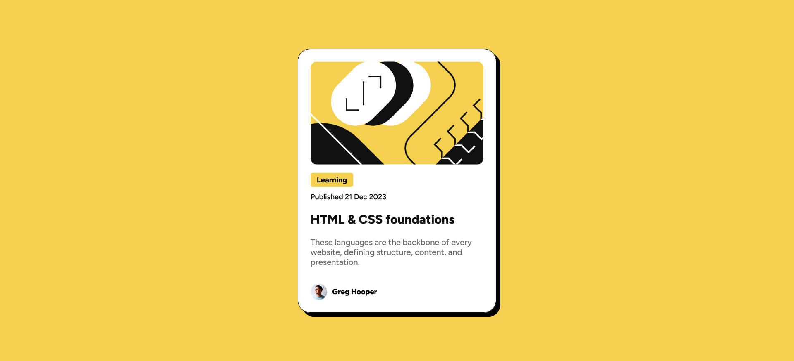

# Frontend Mentor - Blog preview card solution

This is a solution to the [Blog preview card challenge on Frontend Mentor](https://www.frontendmentor.io/challenges/blog-preview-card-ckPaj01IcS). Frontend Mentor challenges help you improve your coding skills by building realistic projects. 

## Table of contents

- [Overview](#overview)
  - [The challenge](#the-challenge)
  - [Screenshot](#screenshot)
  - [Links](#links)
- [My process](#my-process)
  - [Built with](#built-with)
  - [What I learned](#what-i-learned)
  - [Continued development](#continued-development)
- [Author](#author)
- [Acknowledgments](#acknowledgments)

## Overview

### The challenge

Users should be able to:

- See hover and focus states for all interactive elements on the page

### Screenshot

### Links

- [Solution URL](https://github.com/starberries/blog-preview-card)
- [Live Site URL](https://starberries.github.io/blog-preview-card/)

## My process

My first step was plan out how I was going to organize the layout. I knew I was going to have a container element for the card, which would be a colum flexbox to display the inner elements vertically, but I also decided to make the card a regular div with a class of "card" and then put that inside of a main element with a class of "content" as opposed to letting the card float directly in the body tag. This way, the HTML file would have a semantic landmark to make up the majority of the page, and additional div.card elements could be added if you wanted to display multiple article cards on a page. Modularity!

After that was organizing the HTML to match that, grouping the contents inside div.card into their own containers for layout purposes (the article image on its own without need for a container, the article tag, publish date, title, and blurb grouped together, and then author image and name grouped together), then adding the CSS to match up to the preview images.

### Built with

- Semantic HTML5 markup
- CSS custom properties
- Flexbox

### What I learned

I'd say this challenge turned out to be a good practice for creating responsive sized elements in CSS. Also, I think my organization for this challenge turned out a lot better this time around.

Also, I figured out how to turn my current usual CSS reset into an Emmet snippet, so that's neat.

### Continued development

This project was fairly smooth and quick for me to do, so I'm glad to be getting some practice more effectively creating layouts and sizing elements with CSS, and am looking forward to getting to do more complicated projects.

## Author

- Frontend Mentor - [@starberries](https://www.frontendmentor.io/profile/yourusername)
- GitHub - [starberries](https://github.com/starberries)